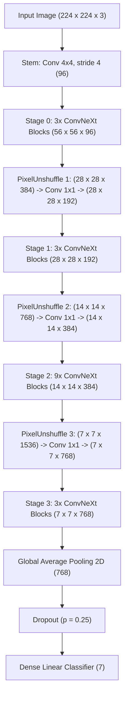

# ConvNeXt-Tiny + PixelUnshuffle Downsampling (Ablation V2)
## Architectural Design, Layer-by-Layer Tensor Shapes & Training Strategy

> [!NOTE]
> This document details the complete technical specification for **Ablation Study V2: ConvNeXt-Tiny + PixelUnshuffle Downsampling** applied to Facial Expression Recognition on FER2013.

---

## 1. Architectural Strategy & Rationale

### Objective
Standard ConvNeXt backbones downsample feature maps between stages using strided 2D Convolutions (`Conv2D(kernel_size=2, stride=2)`). While computationally efficient, strided convolutions aggressively discard spatial details (e.g., subtle micro-expressions, facial muscle contractions around eyes and mouth).

### PixelUnshuffle Solution
PixelUnshuffle (implemented via `tf.nn.space_to_depth(x, block_size=2)`) **rearranges spatial pixels into depth channels without discarding any spatial information**.
- **Spatial Reduction**: Reduces spatial dimensions $H \times W \to \frac{H}{2} \times \frac{W}{2}$.
- **Channel Expansion**: Expands channels $C \to 4C$.
- **Feature Preservation**: A subsequent $1 \times 1$ Convolution (`Conv2D(1x1)`) linearly compresses $4C \to C_{out}$, allowing learned channel projection while retaining lossless fine-grained spatial cues.

```
Standard Downsampling (Baseline):
Spatial Feature (H, W, C) ---> Conv2D(kernel=2, stride=2) ---> (H/2, W/2, C_out)  [Spatial information lost via striding]

PixelUnshuffle Downsampling (Ablation V2):
Spatial Feature (H, W, C) ---> SpaceToDepth(block=2) ---> (H/2, W/2, 4C) ---> Conv2D(1x1) ---> LayerNorm ---> (H/2, W/2, C_out) [Zero spatial loss]
```

---

## 2. Model Architecture & Layer-by-Layer Tensor Shapes

Below is the complete tensor shape progression from raw input image $(224 \times 224 \times 3)$ to final emotion logit predictions $(7)$:



### Detailed Layer Specification Table

| Stage / Module | Layer Component | Sub-Layer Details | Input Shape | Output Shape | Param Weight Source |
| :--- | :--- | :--- | :--- | :--- | :--- |
| **Input** | Raw Image | Normalized RGB tensor | $(B, 224, 224, 3)$ | $(B, 224, 224, 3)$ | Input Data |
| **Stem** | Patchify Stem | `Conv2D(4x4, stride=4, filters=96)` + `LayerNorm` | $(B, 224, 224, 3)$ | **$(B, 56, 56, 96)$** | ImageNet Pretrained |
| **Stage 0** | 3x ConvNeXt Blocks | DWConv $7 \times 7$ $\to$ LN $\to$ Conv $1 \times 1$ (384) $\to$ GELU $\to$ Conv $1 \times 1$ (96) | $(B, 56, 56, 96)$ | **$(B, 56, 56, 96)$** | ImageNet Pretrained |
| **Downsample 1** | PixelUnshuffle 1 | `space_to_depth(block_size=2)` | $(B, 56, 56, 96)$ | $(B, 28, 28, 384)$ | Lossless Operation |
| | Projection 1 | `Conv2D(1x1, filters=192)` + `LayerNorm` | $(B, 28, 28, 384)$ | **$(B, 28, 28, 192)$** | Freshly Initialized |
| **Stage 1** | 3x ConvNeXt Blocks | DWConv $7 \times 7$ $\to$ LN $\to$ Conv $1 \times 1$ (768) $\to$ GELU $\to$ Conv $1 \times 1$ (192) | $(B, 28, 28, 192)$ | **$(B, 28, 28, 192)$** | ImageNet Pretrained |
| **Downsample 2** | PixelUnshuffle 2 | `space_to_depth(block_size=2)` | $(B, 28, 28, 192)$ | $(B, 14, 14, 768)$ | Lossless Operation |
| | Projection 2 | `Conv2D(1x1, filters=384)` + `LayerNorm` | $(B, 14, 14, 768)$ | **$(B, 14, 14, 384)$** | Freshly Initialized |
| **Stage 2** | 9x ConvNeXt Blocks | DWConv $7 \times 7$ $\to$ LN $\to$ Conv $1 \times 1$ (1536) $\to$ GELU $\to$ Conv $1 \times 1$ (384) | $(B, 14, 14, 384)$ | **$(B, 14, 14, 384)$** | ImageNet Pretrained |
| **Downsample 3** | PixelUnshuffle 3 | `space_to_depth(block_size=2)` | $(B, 14, 14, 384)$ | $(B, 7, 7, 1536)$ | Lossless Operation |
| | Projection 3 | `Conv2D(1x1, filters=768)` + `LayerNorm` | $(B, 7, 7, 1536)$ | **$(B, 7, 7, 768)$** | Freshly Initialized |
| **Stage 3** | 3x ConvNeXt Blocks | DWConv $7 \times 7$ $\to$ LN $\to$ Conv $1 \times 1$ (3072) $\to$ GELU $\to$ Conv $1 \times 1$ (768) | $(B, 7, 7, 768)$ | **$(B, 7, 7, 768)$** | ImageNet Pretrained |
| **Global Pool** | Spatial Pooling | `GlobalAveragePooling2D()` | $(B, 7, 7, 768)$ | **$(B, 768)$** | Functional |
| **Classifier** | Output Head | `Dropout(0.25)` $\to$ `Dense(units=7)` | $(B, 768)$ | **$(B, 7)$** | Freshly Initialized |

---

## 3. Training Strategy & Hyperparameter Configuration

> [!TIP]
> **End-to-End Optimization Recipe**: The model is trained from Epoch 1 with an unfreezed backbone using differential learning rates and a 5-epoch Linear Warmup scheduler.

### Key Optimization Parameters

| Category | Parameter | Configured Value | Description / Purpose |
| :--- | :--- | :--- | :--- |
| **Backbone State** | `freeze_backbone_epochs` | **`0`** | Backbone is unfrozen from Epoch 1 (no freeze phase). |
| **Optimizer** | `optimizer` | **`AdamW`** | Standard AdamW for clean architectural comparisons. |
| | `weight_decay` | **`0.035`** | Weight decay regularization. |
| **Learning Rates** | `lr` (Head Base LR) | **`0.0002`** ($2 \times 10^{-4}$) | Peak LR for classification head. |
| | `finetune_lr` | **`0.0002`** ($2 \times 10^{-4}$) | Peak LR for newly added `Conv1x1` downsampling layers. |
| | `visual_extractor_lr` | **`0.00005`** ($5 \times 10^{-5}$) | Peak LR for pretrained ConvNeXt backbone (25% of head LR). |
| **LR Scheduler** | `scheduler` | **`cosine_warmup`** | Linear Warmup (5 Epochs) + Cosine Annealing Decay. |
| | `warmup_epochs` | **`5`** | Linearly ramps LR from 20% to 100% during Epochs 1-5. |
| | `min_lr` | **`1e-6`** | Final floor LR at Epoch 100. |
| **Data Processing** | `use_clean_filter` | **`true`** | Excludes noisy/corrupted Mediapipe faces (`drop345`). |
| | `batch_size_per_gpu` | **`16`** | Global batch size = 32 on 2x Tesla T4 GPUs. |

---

## 4. Learning Rate Schedule Dynamics

```
Epoch 01: head_lr = 0.000041, backbone_lr = 0.000011  [Warmup 20%]
Epoch 02: head_lr = 0.000081, backbone_lr = 0.000021  [Warmup 40%]
Epoch 03: head_lr = 0.000120, backbone_lr = 0.000030  [Warmup 60%]
Epoch 04: head_lr = 0.000160, backbone_lr = 0.000040  [Warmup 80%]
Epoch 05: head_lr = 0.000200, backbone_lr = 0.000050  [Peak LR 100%]
Epoch 06 -> 100: Cosine Annealing Decay down to min_lr (1e-6)
```

---

## 5. Summary of Ablation Comparisons

| Ablation Version | Downsampling Mechanism | Attention Modules | Optimization | Objective |
| :--- | :--- | :--- | :--- | :--- |
| **Baseline ConvNeXt** | Strided Conv2D ($2 \times 2$, stride 2) | None | AdamW + Cosine Warmup | Benchmark standard ConvNeXt-Tiny |
| **Ablation V1 (ELA)** | Strided Conv2D ($2 \times 2$, stride 2) | Efficient Local Attention (ELA) | AdamW + Cosine Warmup | Test 1D Local Frequency Attention |
| **Ablation V2 (PixelUnshuf)** | **`PixelUnshuffle(2) -> Conv1x1`** | **None** | **AdamW + Cosine Warmup** | **Test Lossless Spatial Feature Retention** |
